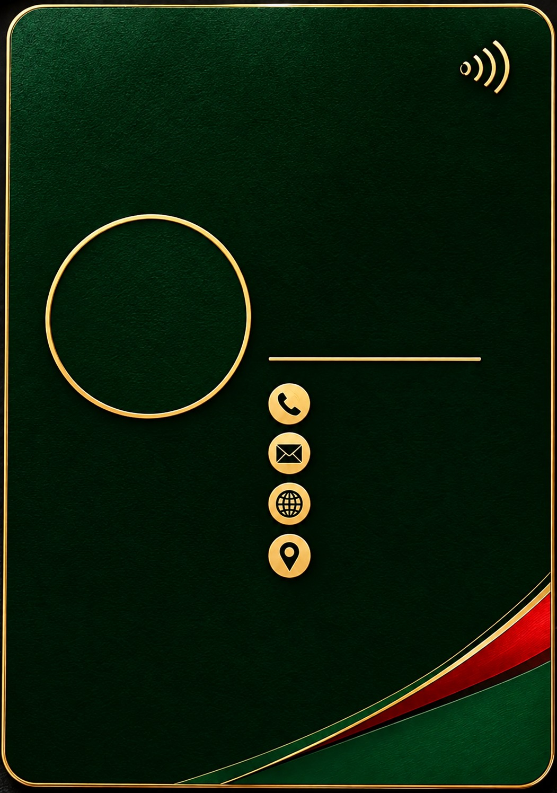
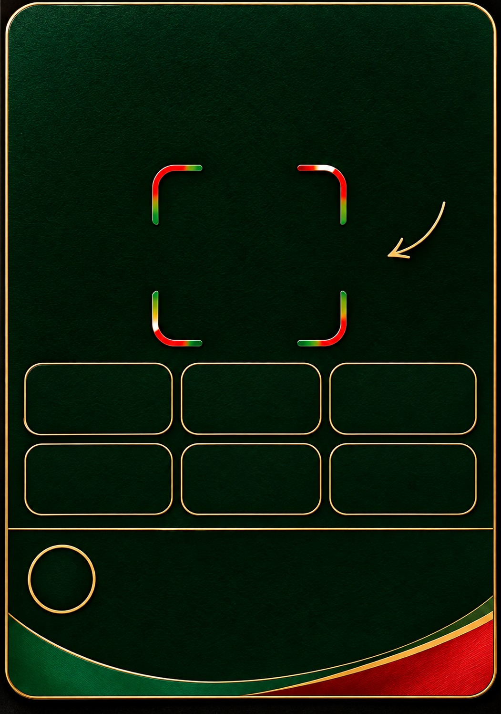

<div align="center">


# Ride Bangla — Digital Business Card

### Enamul Seddik · Co-Founder & CEO

A premium, responsive, NFC-style digital business card for **Ride Bangla Limited**, built as a lightweight static web experience with a realistic 3D card flip, contact actions, QR-based connection flow, service showcase, and VCF contact download.

<p>
  
</p>

<p>
  <a href="https://ridebangla.bd"><strong>Official Website</strong></a>
  ·
  <a href="https://ridebangla.bd">Live Card Destination</a>
</p>

</div>

---

## ✦ Visual Preview

The repository uses its **real project assets directly from GitHub**. Nothing below is a screenshot copied from another README or design reference.

### Brand & Profile

<table>
<tr>
<td align="center" width="50%">

**Ride Bangla Brand Logo**

<br>


</td>
<td align="center" width="50%">

**CEO Profile Photo**

<br>


</td>
</tr>
</table>

### Digital Card Design

<table>
<tr>
<td align="center" width="50%">

**Front Card Artwork**

<br>



</td>
<td align="center" width="50%">

**Back Card Artwork**

<br>



</td>
</tr>
</table>

> **GitHub note:** All preview images above use relative repository paths such as `./logo.png` and `./photo.png`, so GitHub renders the actual assets stored in this repository automatically.

---

## 🚀 What This Project Is

This project is a **single-page digital business card and company profile experience** for:

**Enamul Seddik**  
**Co-Founder & CEO**  
**Ride Bangla Limited**

Instead of behaving like a normal static visiting-card image, the project turns the card design into an interactive web experience.

The main experience combines:

- A realistic front/back business-card interface
- 3D Y-axis card flipping
- NFC-style visual treatment
- Tap-to-flip interaction
- QR-based connection flow
- Click-to-call and click-to-email actions
- Website, WhatsApp, Facebook, X/Twitter and location links
- Contact-card (`.vcf`) download
- Company overview
- Ride Bangla service showcase
- Responsive mobile-first presentation
- Vercel static deployment configuration

---

## 🧩 How The Project Is Built

This repository deliberately keeps the implementation lightweight.

### Core architecture

| Layer | Implementation |
|---|---|
| Page structure | HTML5 |
| Styling | Embedded CSS inside `index.html` |
| Interactions | Vanilla JavaScript |
| Framework | **None** |
| Build tool | **None** |
| Package manager | **None** |
| Application entry | `index.html` |
| Deployment | Vercel / static hosting |
| Card animation | CSS `transform` + `preserve-3d` |
| QR generation | `qrcode-generator` CDN |
| Contact export | Browser-generated `.vcf` |
| Fonts | Google Fonts |
| Service graphics | Repository SVG assets + embedded service artwork |

There is no React, Next.js, Vite, Tailwind, npm dependency tree, or application build pipeline in the repository.

The site can therefore be served directly as a static web page.

---

# 🎨 Design System

The visual direction is based on the Ride Bangla identity already present in the project rather than copying the README screenshots used as design inspiration.

### Main visual language

- Deep green / emerald background
- Gold metallic accents
- Bangladesh-inspired red/green brand colors
- Dark luxury card surface
- Rounded gold card borders
- Red/green diagonal ribbon detail
- Gold contact icons
- Premium serif display typography
- Script typography for the scan/connection treatment
- Soft shadows and depth
- Responsive sizing based on the card artwork dimensions

### Main CSS palette

```css
--gold: #e7c978;
--gold-light: #f5dfa0;
--red: #d51d2a;
```

The card itself uses the supplied `card-front.jpg` and `card-back.jpg` as the visual base layers, while HTML elements are positioned above those artworks for interaction.

---

# 🪪 Digital Card Experience

## Front Side

The front side is built around the actual card artwork and provides the primary personal/business identity.

It includes interactive contact information for:

- Phone
- Email
- Website
- Location
- WhatsApp
- Facebook
- WeChat
- X/Twitter

The front card can be tapped/clicked to rotate to the back.

## Back Side

The back side provides the connection and company-information experience.

It includes:

- QR code
- Scan & Connect area
- Social/contact tiles
- Company overview
- Service showcase
- Official links

The back side does **not** flip accidentally when the user taps an actual link or button. A dedicated back control is used for returning to the front.

---

# 🔄 3D Card Flip

The card uses a real CSS 3D transformation rather than swapping two images.

The core mechanism is:

```css
.inner {
  transform-style: preserve-3d;
  transition: transform .82s cubic-bezier(.2,.75,.18,1);
}

.inner.flipped {
  transform: rotateY(180deg);
}
```

The two faces are stacked together:

```css
.front {
  background-image: url(card-front.jpg);
}

.back {
  background-image: url(card-back.jpg);
  transform: rotateY(180deg);
}
```

Both faces use:

```css
backface-visibility: hidden;
-webkit-backface-visibility: hidden;
```

This produces the physical-card-style rotation seen in the web experience.

---

# 📱 Responsive Card Scaling

The card is based on the supplied artwork ratio:

```text
1051 × 1496
```

The page maintains the same proportion using:

```css
aspect-ratio: 1051/1496;
```

A CSS container query unit is also used:

```css
--u: calc(100cqw/1051);
```

This allows typography and positioned elements to scale with the card rather than relying on a fixed screen size.

That is especially useful for mobile screens.

---

# 👤 Profile Assets

## `logo.png`

The repository contains a transparent PNG version of the Ride Bangla logo.

**Dimensions:** `500 × 500`

It is used as the primary brand asset and is also used inside the QR connection presentation.

The existing project README notes that the logo was prepared with the outer white background removed while preserving the white Bangladesh-map detail inside the logo artwork.

## `photo.png`

The CEO profile image is stored locally in the repository.

**Dimensions:** `640 × 640`

The page presents it as a circular profile image using:

```css
.photo {
  border-radius: 50%;
  overflow: hidden;
}
```

and:

```css
.photo img {
  width: 100%;
  height: 100%;
  object-fit: cover;
}
```

---

# 🖼️ Card Artwork

Two large background artworks form the visual foundation of the interactive card.

| File | Dimensions | Purpose |
|---|---:|---|
| `card-front.jpg` | 1051 × 1496 | Front card artwork |
| `card-back.jpg` | 1051 × 1496 | Back card artwork |

The HTML does not redraw the entire card using hundreds of CSS shapes. Instead, the supplied artwork provides the premium visual surface while HTML/CSS places interactive information over it.

This keeps the design visually consistent with the physical card concept.

---

# 🧰 Services Included

The company information section currently presents these Ride Bangla service areas:

| Service | Description |
|---|---|
| Ride Share | Everyday mobility |
| Food | Food delivery |
| Parcel Delivery | Fast parcel service |
| Courier | Courier solutions |
| Marketplace | Digital marketplace |
| Medicine | Medicine support |
| IT Services | Technology solutions |
| Ride Bangla Pay | Digital payment |

The repository contains dedicated service artwork files under:

```text
assets/services/
```

### Service assets

```text
courier.svg
food.svg
it-services.svg
marketplace.svg
medicine.svg
parcel-delivery.svg
ride-bangla-pay.svg
ride-share.svg
```

These are the repository's service graphic assets.

The current `index.html` also contains embedded service artwork as `data:image/...` resources, so the rendered page can display service visuals without requiring a separate runtime asset request for every icon.

---

# 🔗 Official Links & Contact Actions

The current repository source contains the following contact information:

| Type | Current repository value |
|---|---|
| Website | `https://ridebangla.bd` |
| Email | `info@ridebangla.bd` |
| Phone | `+880 1626 633316` |
| WhatsApp | `https://wa.me/8801626633316` |
| Facebook | `https://www.facebook.com/enamulseddik` |
| X/Twitter | `https://x.com/enamulseddik` |
| Location | Dhaka, Bangladesh |

> These values describe the **current contents of this repository**. If the business contact details change later, update the corresponding HTML/JavaScript values before deployment.

---

# 📲 QR Code System

The QR code is generated dynamically in the browser.

The project loads:

```html
https://cdnjs.cloudflare.com/ajax/libs/qrcode-generator/1.4.4/qrcode.min.js
```

and generates a high-error-correction QR code pointing to:

```text
https://ridebangla.bd
```

The relevant JavaScript flow is conceptually:

```js
const q = qrcode(0, 'H');
q.addData('https://ridebangla.bd');
q.make();
```

The generated SVG is then inserted into the QR container.

This means the QR artwork does not need to be manually regenerated every time the page is loaded.

---

# 💾 Save Contact / VCard

The page includes a **Save Contact** action.

Instead of requiring a server endpoint, JavaScript builds a standard vCard in the browser:

```text
BEGIN:VCARD
VERSION:3.0
...
END:VCARD
```

The browser creates a Blob and downloads:

```text
Enamul-Seddik-RideBangla.vcf
```

The current vCard contains:

- Enamul Seddik
- Ride Bangla Limited
- Co-Founder & CEO
- Phone
- Email
- Website
- Dhaka, Bangladesh

This is a completely client-side operation.

---

# 🖋️ Typography

The project imports these Google Fonts:

```text
Allura
Cormorant Garamond
Lato
```

They are loaded from Google Fonts:

```text
https://fonts.googleapis.com/
```

### Usage

| Font | Role |
|---|---|
| Lato | General UI/body text |
| Cormorant Garamond | Name / premium display typography |
| Allura | Script-style connection text |

A fallback stack is also provided so the page remains readable if the external font request is unavailable.

---

# 🧠 JavaScript Features

The JavaScript is intentionally contained inside `index.html`.

### Implemented behaviors

1. **Front/back card flip**
2. **Keyboard-accessible card interaction**
3. **Dynamic QR generation**
4. **Service asset load handling**
5. **Responsive text fitting**
6. **Save-contact `.vcf` generation**
7. **WeChat display interaction**
8. **External link handling**
9. **Back-to-card interaction**
10. **Dynamic card scaling**

The project therefore does not require a separate JavaScript application bundle.

---

# ♿ Interaction & Accessibility Details

The source includes several accessibility-oriented details, including:

- Semantic links for contact actions
- `alt` text for the primary logo/profile image
- Keyboard interaction for the card
- `Enter` / `Space` support for the flip interaction
- `aria-hidden` usage for decorative elements
- `rel="noopener"` on external links
- Native browser actions for phone/email links

The visual experience is designed primarily for mobile use but remains responsive on larger screens.

---

# 📁 Repository Structure

```text
CEO-NFC-Visiting-Card--main/
│
├── README.md
├── .gitignore
├── index.html
├── vercel.json
│
├── logo.png
├── photo.png
├── card-front.jpg
├── card-back.jpg
│
└── assets/
    └── services/
        ├── courier.svg
        ├── food.svg
        ├── it-services.svg
        ├── marketplace.svg
        ├── medicine.svg
        ├── parcel-delivery.svg
        ├── ride-bangla-pay.svg
        └── ride-share.svg
```

---

# 📄 File-by-File Explanation

## `index.html`

The main application file.

It contains:

- HTML structure
- Embedded CSS
- Card layout
- Profile information
- Company overview
- Services
- Official links
- SVG interface icons
- QR container
- JavaScript interactions
- vCard generation

There is no separate `src/` directory because the project is intentionally implemented as a single static page.

---

## `logo.png`

Primary Ride Bangla brand logo.

Used for:

- Brand presentation
- Card identity
- QR connection presentation

---

## `photo.png`

CEO profile image.

Used for the personal identity portion of the digital card.

---

## `card-front.jpg`

Premium dark-green/gold front-card artwork.

Used as:

```css
background-image: url(card-front.jpg);
```

---

## `card-back.jpg`

Matching back-card artwork.

Used as:

```css
background-image: url(card-back.jpg);
```

---

## `assets/services/*.svg`

Individual Ride Bangla service illustrations.

They represent the service categories displayed by the company-information section.

---

## `vercel.json`

Static hosting configuration for Vercel.

Current configuration includes:

- Clean URLs
- Rewrite to `index.html`
- `X-Content-Type-Options: nosniff`
- `Referrer-Policy: strict-origin-when-cross-origin`

The rewrite allows the static page to continue serving correctly through the configured Vercel route.

---

## `.gitignore`

Standard ignore rules for common development/build artifacts, including:

- Logs
- Node modules
- Build outputs
- Environment files
- Cache folders
- Framework-generated directories
- Vite-related temporary files

The repository itself does not require npm dependencies to run.

---

# 🌐 External Resources

Although the project itself is static and self-contained in structure, two external resources are currently loaded by `index.html`.

### Google Fonts

Used for:

```text
Allura
Cormorant Garamond
Lato
```

### QR Generator CDN

Used for dynamic QR generation:

```text
qrcode-generator 1.4.4
```

No backend API is required by the current page.

---

# 🔐 Data & Runtime Model

This is a client-side static website.

There is currently:

- No database
- No authentication system
- No server-side application
- No API backend
- No npm dependency installation
- No build command
- No server-side contact form

Contact actions are handled through standard browser protocols such as:

```text
tel:
mailto:
https:
```

The vCard is generated locally in the visitor's browser.

---

# 🚀 Deployment

Because the project is static, it can be deployed to:

- Vercel
- Netlify
- GitHub Pages
- Any compatible static web host

## Vercel

The repository already contains:

```text
vercel.json
```

and is configured to serve:

```text
index.html
```

as the application entry point.

### Basic deployment flow

```text
GitHub Repository
       │
       ▼
   Vercel Project
       │
       ▼
    index.html
       │
       ├── logo.png
       ├── photo.png
       ├── card-front.jpg
       ├── card-back.jpg
       └── assets/services/*.svg
```

No build step is required for the current repository.

---

# ✏️ Customization Guide

For future updates, the main place to work is:

```text
index.html
```

### Change the website

Search for:

```text
https://ridebangla.bd
```

### Change the phone number

Search for:

```text
+8801626633316
```

### Change the email

Search for:

```text
info@ridebangla.bd
```

### Change social links

Search for:

```text
facebook.com/enamulseddik
x.com/enamulseddik
wa.me/8801626633316
```

### Replace the logo

Keep the same filename:

```text
logo.png
```

### Replace the profile image

Keep the same filename:

```text
photo.png
```

### Replace the card artwork

Keep the same filenames:

```text
card-front.jpg
card-back.jpg
```

This avoids unnecessary HTML changes.

---

# 🧱 Why There Is No Framework

The project does not need a large application framework because its purpose is a focused digital business-card experience.

The static approach provides:

- Minimal project complexity
- No package installation
- No build pipeline
- Easy GitHub maintenance
- Easy Vercel deployment
- Fast initial page loading
- Simple asset management
- Easy handover to another developer

The trade-off is that larger future features would require a more structured application architecture.

---

# 🗺️ Project Flow

```text
Visitor opens digital card
          │
          ▼
   Front of the card
          │
          ├── Call
          ├── Email
          ├── Website
          ├── WhatsApp
          ├── Facebook
          ├── X/Twitter
          └── Location
          │
          ▼
      Tap / Click
          │
          ▼
     3D card flips
          │
          ▼
    Back of the card
          │
          ├── QR connection
          ├── Social/contact tiles
          ├── Company overview
          └── Service showcase
          │
          ▼
     Save Contact
          │
          ▼
 Enamul-Seddik-RideBangla.vcf
```

---

# 🏢 About Ride Bangla

**Ride Bangla Limited** is presented in this project as a Bangladesh-based multi-service platform focused on bringing everyday mobility, food, parcel, courier and digital-service needs into a simple digital experience.

The current card/company section presents the following positioning:

> **Ride • Food • Delivery • Courier • Digital Services**

The service categories represented by the current source are:

**Ride Share · Food · Parcel Delivery · Courier · Marketplace · Medicine · IT Services · Ride Bangla Pay**

---

# 📌 Current Repository Snapshot

This README documents the source exactly as supplied in the repository.

### Current entry point

```text
index.html
```

### Current deployment configuration

```text
vercel.json
```

### Primary brand assets

```text
logo.png
photo.png
card-front.jpg
card-back.jpg
```

### Service asset directory

```text
assets/services/
```

### Application style

```text
Static HTML + CSS + Vanilla JavaScript
```

### Build requirement

```text
No build step
```

### Backend requirement

```text
None
```

---

# 📜 License / Ownership

The current card identifies the project as:

**Ride Bangla Limited**

and the card source uses a proprietary presentation for the Ride Bangla brand and digital business-card experience.

If this repository is distributed publicly, add the project's final legal licensing/ownership statement here according to the actual ownership and distribution policy.

---

<div align="center">

### Ride Bangla

**One digital card. One professional identity.**

`Ride Bangla Limited · Dhaka, Bangladesh`

<br>


</div>
