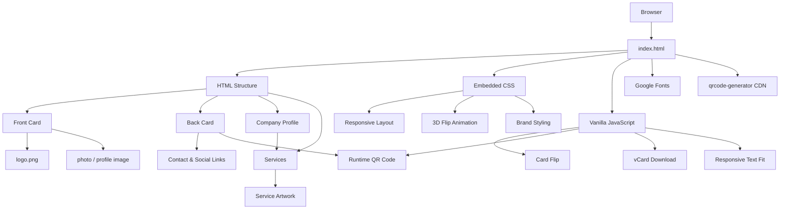

::: {align="center"}
``{=html}

# Ride Bangla --- Digital Business Card

### Interactive NFC-Style Digital Visiting Card for Enamul Seddik

A premium, responsive digital business card for **Enamul Seddik ---
Co-Founder & CEO, Ride Bangla**, built as a lightweight static web
application with a realistic 3D card-flip experience, contact actions,
QR-based connection flow, downloadable vCard, company profile and
service showcase.

```{=html}
<p>
```
`<a href="https://ridebangla.bd">`{=html}🌐 Ride Bangla`</a>`{=html} •
`<a href="https://ridebangla.bd">`{=html}🚀 Live Website`</a>`{=html}
```{=html}
</p>
```
:::

------------------------------------------------------------------------

## ✨ Preview

  ---------------------------------------------------------------------------------------------------------------------------------------------------------------------------------------------
                                           Front of Card                                                                                  Back of Card
  ----------------------------------------------------------------------------------------------- ---------------------------------------------------------------------------------------------
   ``{=html}   ``{=html}

  ---------------------------------------------------------------------------------------------------------------------------------------------------------------------------------------------

> **Note:** `card-front.jpg` and `card-back.jpg` are the actual visual
> card backgrounds used by the application. The HTML layer places the
> interactive logo, profile photo, text, contact actions and QR
> interface over these backgrounds.

------------------------------------------------------------------------

## 🎯 What This Project Is

This repository contains a **static digital visiting-card web
application** designed around the Ride Bangla brand.

Instead of using a conventional business-card page, the project
recreates a physical visiting card digitally:

-   The **front side** presents the personal identity and contact
    information.
-   Tapping/clicking the card performs a **3D Y-axis flip**.
-   The **back side** provides QR-based connection and social/contact
    links.
-   A **Save Contact to Phone** action generates a `.vcf` contact file
    directly in the browser.
-   A company profile section introduces **Ride Bangla Limited** and its
    services.
-   The entire experience is responsive and optimized for mobile-first
    use.

------------------------------------------------------------------------

## 🧩 Technology Stack

This project intentionally keeps the technology stack lightweight.

  -----------------------------------------------------------------------
  Technology                          Usage
  ----------------------------------- -----------------------------------
  **HTML5**                           Page structure, card faces, contact
                                      information, company profile and
                                      service sections

  **CSS3**                            Responsive layout, gradients,
                                      typography, shadows, card sizing
                                      and 3D animation

  **Vanilla JavaScript**              Card flipping, QR generation,
                                      responsive text fitting and vCard
                                      download

  **CSS 3D Transforms**               `perspective`,
                                      `transform-style: preserve-3d` and
                                      `rotateY()` for the card flip

  **Google Fonts**                    Allura, Cormorant Garamond and Lato

  **QRCode Generator 1.4.4**          Runtime QR-code generation through
                                      CDN

  **Vercel**                          Static deployment configuration
                                      through `vercel.json`

  **SVG / PNG / JPG**                 Brand, profile, card and service
                                      artwork
  -----------------------------------------------------------------------

### No Framework Required

There is currently:

-   ❌ No React
-   ❌ No Next.js
-   ❌ No Vue
-   ❌ No Angular
-   ❌ No Vite
-   ❌ No Webpack
-   ❌ No Node.js build step
-   ❌ No `package.json`
-   ❌ No dependency installation required for deployment

The main application is contained in a single:

``` text
index.html
```

That makes the project portable to virtually any static hosting
environment.

------------------------------------------------------------------------

## 🏗️ How It Is Built

The application can be understood as five main layers:



------------------------------------------------------------------------

# 💳 Digital Card Architecture

## 1. Front Side

The front card uses:

``` html
<article class="face front" id="front">
```

The visual background is:

``` css
.front {
  background-image: url(card-front.jpg);
}
```

The front side contains:

-   Ride Bangla logo
-   Profile photo
-   Name
-   Job title
-   Phone number
-   Email
-   Website
-   Location
-   Tap-to-connect interaction

The card maintains a fixed visual proportion based on the source
artwork:

``` css
aspect-ratio: 1051 / 1496;
```

This keeps the digital card visually consistent with the original card
design.

------------------------------------------------------------------------

## 2. Back Side

The reverse side uses:

``` html
<article class="face back" id="back">
```

with:

``` css
.back {
  background-image: url(card-back.jpg);
  transform: rotateY(180deg);
}
```

The back side provides:

-   QR code
-   Website
-   WhatsApp
-   Facebook
-   WeChat interaction
-   X/Twitter
-   Location
-   About Us section

The back is intentionally interactive while keeping the original card
artwork as the visual foundation.

------------------------------------------------------------------------

# 🔄 3D Card Flip

The flip system is implemented entirely with CSS and Vanilla JavaScript.

The card container uses:

``` css
.card-wrap {
  perspective: 1800px;
}
```

The inner element preserves the 3D scene:

``` css
.inner {
  transform-style: preserve-3d;
  transition: transform .82s cubic-bezier(.2,.75,.18,1);
}
```

When the card receives the flip state:

``` css
.inner.flipped {
  transform: rotateY(180deg);
}
```

JavaScript toggles the class:

``` javascript
inner.classList.toggle('flipped');
```

This creates the physical-card-style front-to-back transition without
requiring a UI framework.

------------------------------------------------------------------------

# 📱 Responsive Design

The card is designed around a responsive container:

``` css
.page {
  width: min(100%, 430px);
  margin: auto;
}
```

The card uses container-based sizing so its typography and positioned
elements scale with the card.

The layout also uses:

-   `max()`
-   `min()`
-   CSS variables
-   container queries
-   relative sizing
-   responsive grids
-   mobile-friendly touch targets

This allows the same source to work on phones and larger screens without
maintaining separate mobile and desktop layouts.

------------------------------------------------------------------------

# 🔳 QR Code System

The QR code is generated **at runtime in the browser**.

The project loads:

``` text
qrcode-generator 1.4.4
```

from the cdnjs CDN.

The JavaScript creates a high-error-correction QR:

``` javascript
const q = qrcode(0, 'H');
q.addData('https://ridebangla.bd');
q.make();
```

The generated SVG is then inserted into:

``` html
<div id="qr"></div>
```

### Current QR Destination

``` text
https://ridebangla.bd
```

So the QR code does not depend on a pre-rendered QR image file.

------------------------------------------------------------------------

# 📇 Save Contact / vCard

The **Save Contact to Phone** button creates a standard `.vcf` contact
directly in the browser.

The generated contact contains:

-   Name
-   Organization
-   Job title
-   Phone
-   Email
-   Website
-   Work location

The generated filename is:

``` text
Enamul-Seddik-RideBangla.vcf
```

The implementation uses the browser's:

``` javascript
Blob
URL.createObjectURL()
```

APIs, so no server-side contact-generation service is required.

------------------------------------------------------------------------

# 🔗 Contact & Social Actions

The card currently contains these connection targets:

  Action        Destination
  ------------- -----------------------------
  Phone         `+880 1626 633316`
  Email         `info@ridebangla.bd`
  Website       `https://ridebangla.bd`
  WhatsApp      Ride Bangla contact number
  Facebook      `facebook.com/enamulseddik`
  X / Twitter   `x.com/enamulseddik`
  Location      Dhaka, Bangladesh
  WeChat        Interactive display action

Phone and email use browser-native:

``` text
tel:
mailto:
```

links for quick access from supported devices.

------------------------------------------------------------------------

# 🏢 Company Profile Section

Below the interactive card, the project includes an **Official Company
Profile** section for:

## Ride Bangla Limited

The profile contains:

-   Company name
-   Short company overview
-   Official links
-   Contact details
-   Service categories
-   Footer information

The company description presents Ride Bangla as a Bangladesh-based
multi-service platform focused on mobility, food, parcel, courier and
digital services.

------------------------------------------------------------------------

# 🛠️ Services Included

The current company profile presents eight service categories:

  Service                  Description
  ------------------------ ----------------------
  🚗 **Ride Share**        Everyday mobility
  🍔 **Food**              Food delivery
  📦 **Parcel Delivery**   Fast parcel service
  🚚 **Courier**           Courier solutions
  🛒 **Marketplace**       Digital marketplace
  💊 **Medicine**          Medicine support
  💻 **IT Services**       Technology solutions
  💳 **Ride Bangla Pay**   Digital payment

The repository also contains service artwork under:

``` text
assets/services/
```

with individual SVG files for the service categories.

------------------------------------------------------------------------

# 🎨 Brand & Visual System

The visual language is built around the Ride Bangla identity.

Primary design characteristics include:

-   Deep green background
-   Gold/gold-light typography and accents
-   Ride Bangla red accent
-   Dark premium card presentation
-   Rounded corners
-   Soft shadows
-   Gradient surfaces
-   Gold borders
-   Premium serif display typography
-   Script typography for selected decorative text

The main CSS variables include:

``` css
--gold: #e7c978;
--gold-light: #f5dfa0;
--red: #d51d2a;
```

This makes the main brand palette easy to maintain from one location.

------------------------------------------------------------------------

# 🔤 Typography

The project imports these Google Fonts:

### Allura

Used for decorative script-style text such as the scan/connect
treatment.

### Cormorant Garamond

Used for premium display typography, including the name and company
heading.

### Lato

Used for general interface and body text.

The fonts are loaded from Google Fonts:

``` text
fonts.googleapis.com
```

------------------------------------------------------------------------

# 🖼️ Assets

The repository includes the following main visual assets.

  File                      Purpose
  ------------------------- -------------------------------
  `logo.png`                Ride Bangla logo
  `photo.png`               Profile/headshot image
  `card-front.jpg`          Front card artwork/background
  `card-back.jpg`           Back card artwork/background
  `assets/services/*.svg`   Service artwork

### Image Specifications

  Asset                       Size
  ------------------ -------------
  `logo.png`             500 × 500
  `photo.png`            640 × 640
  `card-front.jpg`     1051 × 1496
  `card-back.jpg`      1051 × 1496

The HTML also contains embedded image data for some visual elements,
including the profile image and service artwork.

------------------------------------------------------------------------

# 📁 Repository Structure

``` text
CEO-NFC-Visiting-Card/
│
├── index.html
├── logo.png
├── photo.png
├── card-front.jpg
├── card-back.jpg
├── vercel.json
├── .gitignore
│
├── assets/
│   └── services/
│       ├── courier.svg
│       ├── food.svg
│       ├── it-services.svg
│       ├── marketplace.svg
│       ├── medicine.svg
│       ├── parcel-delivery.svg
│       ├── ride-bangla-pay.svg
│       └── ride-share.svg
│
└── README.md
```

------------------------------------------------------------------------

# 🧠 Main Source File

## `index.html`

This is the core of the entire application.

It contains:

### HTML

-   Card structure
-   Front/back faces
-   Contact links
-   QR container
-   Company profile
-   Service grid
-   Footer

### CSS

-   Complete visual design
-   Responsive layout
-   Card proportions
-   3D animation
-   Typography
-   Buttons
-   Service cards
-   Company profile styling
-   Reduced-motion support

### JavaScript

-   Card flipping
-   QR-code creation
-   Responsive text fitting
-   vCard generation/download
-   WeChat display interaction

Because all three layers are contained in one file, deployment is simple
and there is no compilation pipeline.

------------------------------------------------------------------------

# ⚙️ `vercel.json`

The project includes a Vercel configuration file.

It provides:

### Clean URLs

``` json
"cleanUrls": true
```

### SPA-style rewrite

``` json
"rewrites": [
  {
    "source": "/(.*)",
    "destination": "/index.html"
  }
]
```

### Security-related response headers

The configuration currently sets:

``` text
X-Content-Type-Options: nosniff
Referrer-Policy: strict-origin-when-cross-origin
```

This allows the static project to be deployed through Vercel with
project-specific routing and response-header configuration.

------------------------------------------------------------------------

# 🚀 Deployment

Because this is a static project, deployment does not require:

``` text
npm install
npm run build
npm start
```

A static host can serve the repository directly.

## Vercel

1.  Import the GitHub repository into Vercel.
2.  Select the repository.
3.  No framework should be required.
4.  Deploy.
5.  Vercel uses the included `vercel.json` configuration.

## Other Static Hosts

The project can also be hosted on services that support static HTML
files, such as:

-   GitHub Pages
-   Netlify
-   Cloudflare Pages
-   Any conventional web server

For hosts that do not need rewrite rules, the essential deployment files
are simply the project assets and `index.html`.

------------------------------------------------------------------------

# 🛠️ Customization Guide

## Change the Logo

Replace:

``` text
logo.png
```

with another logo using the same filename.

For best visual consistency, use a transparent PNG.

------------------------------------------------------------------------

## Change the Profile Photo

Replace:

``` text
photo.png
```

with another image.

A square image works best because the card displays the profile image
inside a circular frame.

------------------------------------------------------------------------

## Change the Card Artwork

Replace:

``` text
card-front.jpg
card-back.jpg
```

with new artwork while preserving the same visual dimensions/aspect
ratio.

------------------------------------------------------------------------

## Change Contact Information

Search inside:

``` text
index.html
```

for the current:

``` text
Phone
Email
Website
Location
```

and update both the visible links and the vCard data where applicable.

------------------------------------------------------------------------

## Change the QR Destination

Find:

``` javascript
q.addData('https://ridebangla.bd');
```

and replace the URL with the desired destination.

------------------------------------------------------------------------

## Change Social Links

The social/contact URLs are defined directly inside the HTML anchors.

Update the relevant `href` values for:

``` text
Website
WhatsApp
Facebook
X / Twitter
Location
```

------------------------------------------------------------------------

# 🔐 Privacy & Security Notes

This project is primarily client-side.

There is no application backend or database in the repository.

The browser handles:

-   Card interaction
-   QR generation
-   vCard generation
-   Contact links

However, the application currently requests two external resources:

1.  **Google Fonts**
2.  **QRCode Generator library from cdnjs**

The actual contact data displayed by the card is present in the
HTML/JavaScript source, so anyone who can access the deployed page can
inspect those values.

------------------------------------------------------------------------

# 📱 User Experience Flow

``` text
Open digital card
       ↓
View Ride Bangla / Enamul Seddik profile
       ↓
Tap / click the card
       ↓
3D flip animation
       ↓
Scan QR / open contact links
       ↓
Save contact to phone
       ↓
Explore Ride Bangla company profile
       ↓
View service categories
```

------------------------------------------------------------------------

# ✅ Current Feature Checklist

-   [x] Premium digital visiting-card interface
-   [x] Front/back card design
-   [x] 3D card flip
-   [x] Responsive card scaling
-   [x] Ride Bangla logo
-   [x] Profile photo
-   [x] Phone action
-   [x] Email action
-   [x] Website action
-   [x] WhatsApp action
-   [x] Facebook action
-   [x] X/Twitter action
-   [x] Google Maps location action
-   [x] Runtime QR generation
-   [x] QR SVG rendering
-   [x] Save Contact `.vcf`
-   [x] Company profile
-   [x] Service showcase
-   [x] Vercel configuration
-   [x] Reduced-motion preference support
-   [x] No framework/build pipeline required

------------------------------------------------------------------------

# 📌 Project Summary

**Ride Bangla Digital Business Card** combines a physical visiting-card
aesthetic with modern web interaction.

The implementation deliberately stays lightweight:

``` text
HTML5
  +
CSS3
  +
Vanilla JavaScript
  +
Local visual assets
  +
Google Fonts
  +
QRCode Generator CDN
  +
Vercel static deployment
```

The result is a portable, responsive and interactive digital business
card that can be opened from a normal URL and used directly from a
mobile device.

------------------------------------------------------------------------

::: {align="center"}
### Ride Bangla

**Ride • Food • Delivery • Courier • Digital Services**

🌐 https://ridebangla.bd

© Ride Bangla 2026
:::
